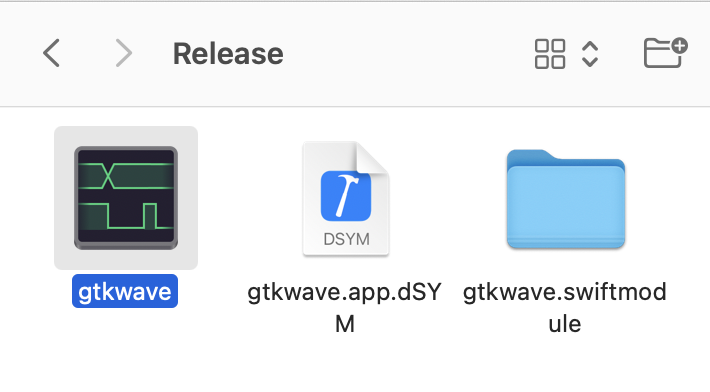

# Apple Macintosh

## OSX / Homebrew

An older build of GTKWave LTS for macOS can be found on SourceForge:
[download](https://gtkwave.sourceforge.net/gtkwave.zip)

However, this version is not compatible with current versions of macOS.
To run GTKWave on newer macOS version this community provided
[Homebrew tap](https://github.com/randomplum/homebrew-gtkwave) can be used.
Additional information about running GTKWave on newer macOS
can be found in this [GitHub issue](https://github.com/gtkwave/gtkwave/issues/250).

You can also follow the steps below to compile GTKWave 4 from source.

## Compiling GTKWave 4

GTKWave 4 is the development version with a lots of
improvements and changes. Please refer to the
[changelog](https://github.com/gtkwave/gtkwave/blob/master/CHANGELOG.md)
for all notable changes.

### Installing dependencies

1. **Install Xcode Command Line Tools** (if not already installed):

    Xcode Command Line Tools are required for building software on macOS. To install them, open Terminal and run:

    ```shell
    xcode-select --install
    ```

    You’ll be prompted to start the installation, and then prompted again to accept a software license. Then the tools will download and install automatically.

2. **Install Homebrew** (if not already installed):

    ```shell
    /bin/bash -c "$(curl -fsSL https://raw.githubusercontent.com/Homebrew/install/HEAD/install.sh)"
    ```

3. **Install dependencies** 

    using Homebrew:

    ```shell
    brew install desktop-file-utils shared-mime-info gobject-introspection gtk-mac-integration meson ninja pkg-config gtk+3 gtk4
    ```

### Compiling and Installing

Clone the source code from the git repository:

```shell
git clone https://github.com/gtkwave/gtkwave.git gtkwave
cd gtkwave
```

To build GTKWave, run:

```shell
# Use --prefix to specify the installation path
meson setup build --prefix=/opt
# Or install to default path (/usr/local):
# meson setup build
meson compile -C build # Start compile
sudo meson install -C build # Install gtkwave
```

GTKWave is now installed on your macOS. You can start it in your terminal, run:

```shell
gtkwave
```

### Building macOS Application

Ensure you have installed the dependencies as described [above](#installing-dependencies) and compiled GTKWave as described [above](#compiling-and-installing).

Then run the following command to build the macOS application:
```shell
cd macos
xcodebuild
```
You can find the application in the `macos/build/Release` directory.



Just copy the application to your Applications folder and run it from there.

## Troubleshooting

If you encounter any errors during the installation process, please refer to the [GitHub issue](https://github.com/gtkwave/gtkwave/issues) for additional help and troubleshooting tips.
